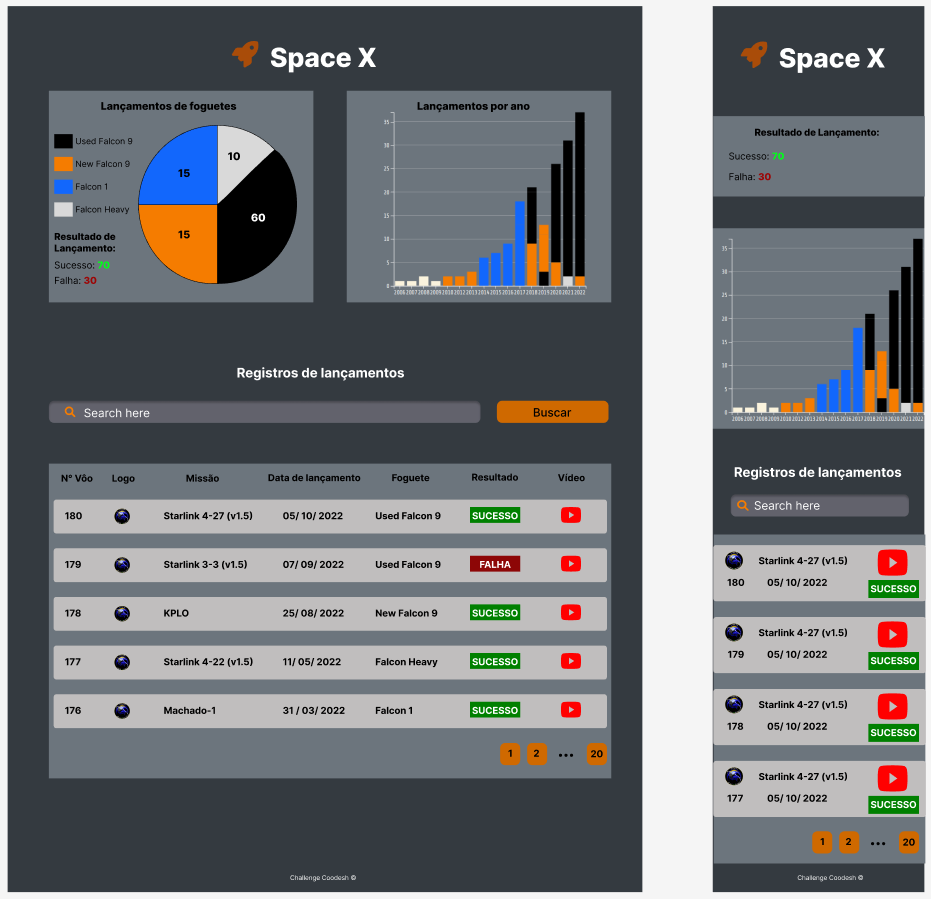

# Fullstack Challenge 🏅 Space X API

Este é um desafio para podermos ver suas habilidades como Fullstack Developer.
Nesse desafio você deverá desenvolver um aplicativo para listar informações da API SpaceX-API.

[SPOILER] As instruções de entrega e apresentação do challenge estão no final deste Readme (=

### Instruções iniciais obrigatórias

- Utilizar o seu github pessoal para publicar o desafio.
- Utilize as seguintes tecnologias:

#### Tecnologias (Front-End):
- Utilizando o framework React.JS (https://pt-br.reactjs.org)
- Estilização (Material UI, Semantic UI, Styled Components, etc). Ou escrever o seu proprio sob medida 👌
- Design Mobile First
- Gestão de dados (Redux, Context API, Localstorage, etc)

Atente-se, ao desenvolver a aplicação front-end, para conceitos de usabilidade e adeque a interface com elementos visuais para os usuários do seu sistema.

#### Tecnologias (Back-End):
- API Rest com o uso do framework Node.JS (https://nodejs.org/pt-br/) 
- Banco de dados (Postgres, MySQL, MongoDB, etc).

Como sugestões, pode criar um banco de dados grátis **MongoDB** usando Atlas: https://www.mongodb.com/cloud/atlas.

#### Organização:
- Separar o repositório do back do front
- Aplicação de padrões Clean Code

### Modelo de Dados:
Indicado na documentação da API https://github.com/r-spacex/SpaceX-API.

### Front-End:

Nessa etapa você deverá desenvolver uma aplicação web para consumir a API que irá criar.

### INSTRUÇÕES

Obrigatório 1 - Você deverá atender aos seguintes casos de uso:
- Como usuário, devo ser capaz de visualizar um gráfico de pizza/setor sobre o lançamento dos foguetes;
- Como usuário, devo ser capaz de visualizar os resultados de lançamentos (sucesso e falha);
- Como usuário, devo ser capaz de visualizar um gráfico de colunas com o laçamento de foguetes por ano (atente-se para a coloração, ela deve ser semelhante  ao que foi atribuído no gráfico de pizza/setor);
- Como usuário, devo ser capaz de pesquisar pelo nome, missão e/ou resultado;
- Como usuário, devo ser capaz de visualizar o vídeo no YouTube ao apertar no ícone;
- Como usuário, devo ser capaz de mudar de página aparecendo os próximos 5 lançamentos.

**Obrigatório 2** - Seguir o wireframe para mostrar os dados necessários, estilização ao seu critério conforme seus conhecimentos de usabilidade.



**Diferencial 1** - Colocar na URL os parâmetros utilizados na busca, para compartilhar a URL;

**Diferencial 2** - Configurar Docker no Projeto para facilitar o Deploy da equipe de DevOps;

**Diferencial 3** - Escrever Unit Tests e/ou E2E Test. Escolher a melhor abordagem e biblioteca;


### Back-End:

Nessa etapa você deverá construir uma API Restful com as melhores práticas de desenvolvimento. Para isso você deve executar os passos a seguir:

### INSTRUÇÕES

**Obrigatório 1** - Você deverá desenvolver as seguintes rotas:

<details open>
<summary>[GET] /</summary>
<p>
Retornar a mensagem "Fullstack Challenge 🏅 - Space X API"
</p>

```json
{
    "message": "Fullstack Challenge 🏅 - Space X API"
}
```
</details>

<details open>
<summary>[GET] /launches</summary>
<p>
Listar todos os dados da base, com paginação e suporte a busca. O endpoint de paginação de uma busca hipotética deve retornar a seguinte estrutura:
<br/>
[GET]/launches?search=tesla&limit=4
</p>

```json
{
    "results": [
        {.....},
        {.....},
        {.....},
        {.....},
    ],
    "totalDocs": 20,
    "page": 1,
    "totalPages": 5, 
    "hasNext": true,
    "hasPrev": false
}
```
</details>
<details open>
<summary>[GET] /launches/stats</summary>
<p>
Deve retornar os dados que serão usados nos gráficos da interface. O formato de saída final pode depender da biblioteca utilizada no frontend. Além disso, pode ser necessário criar mais de um endpoint para separar os dois gráficos, considerando a performance e a quantidade de cálculos e consultas ao banco.

- O campo `success` informa se o lançamento ocorreu com ou sem falhas. Faça a contagem dos registros para obter o resultado de sucessos e falhas;
- O campo `cores.reused` informa se o lançamento usou estágios reaproveitáveis. Para obter o nome do estágio, busque pelo nome do foguete usando o campo `rocket`;
- Ao analisar os registros será possível contabilizar a quantidade de lançamentos separados por foguete e renderizar o gráfico de pizza;
- Os dados do gráfico de barras são agrupados por mês/ano e por foguete.

</p>

</details>

Além disso, os endpoints devem utilizar os seguintes códigos de status:
- 200: sucesso com body ou sem body
- 204: sucesso sem body
- 400: mensagem de erro em formato humanizado, ou seja, sem informações internas e códigos de erro:

```json
{
    "message": "Error message"
}
```

**Obrigatório 1** - Para alimentar o seu banco de dados você deve criar um script que armazene os dados dos lançamentos da SpaceX API no seu back-end.

**Obrigatório 2** - Além disso, você precisa desenvolver um CRON para ser executado diariamente e armazenar os novos lançamentos ao seu banco de dados. (Para essa tarefa você pode precisar fazer alterações no modelo de dados)

**Obrigatório 3** - Descrever a documentação da API.

**Diferencial 1** - Configurar Docker no Projeto para facilitar o Deploy da equipe de DevOps;

**Diferencial 2** - Configurar um sistema de alerta se houver alguma falha durante a sincronização dos lançamentos (Execução do CRON);

**Diferencial 3** - Escrever Unit Tests para os endpoints da API;

## Readme do Repositório

- Deve conter o título do projeto
- Uma descrição sobre o projeto em frase
- Deve conter uma lista com linguagem, framework e/ou tecnologias usadas
- Como instalar e usar o projeto (instruções)
- Não esqueça o [.gitignore](https://www.toptal.com/developers/gitignore)

## Finalização e Instruções para a Apresentação

Para avisar sobre a finalização e enviar para correção.

1. Encaminhe a URL do seu repositório ao solicitante do teste (Não esqueça de verificar se o repositório é público);
